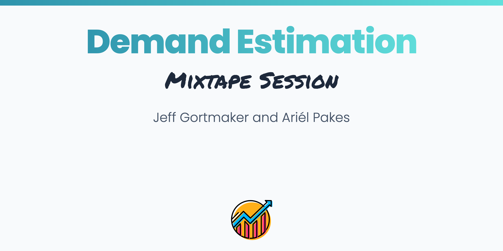

 
 

## About

This three-day workshop covers the Berry-Levinsohn-Pakes (BLP) approach to estimating the statistical relationship between product sales and product characteristics such as prices. As the foundational approach for differentiated products demand estimation in the industrial organization literature, BLP is used by academics, antitrust regulators, and industry professionals to shed light on difficult questions.
- “What is the value of a new good?”
- “Will a merger hurt consumers?”
- “Should we change prices?”

Through a running empirical example, the workshop will use a series of coding exercises to build up practical knowledge for studying these types of questions and more.
  
This is one of our advanced courses. These courses are designed <strong>assuming a solid foundation in the basics of economic models and instrumental variables</strong>. Scott's Causal Inference (<a class="underline" href="https://github.com/Mixtape-Sessions/Causal-Inference-1">Part 1</a>) covers instrumental variables.

## Schedule

<b>Day 1</b>
 

<b>Topics</b>
- History and motivation for BLP (by Arial Pakes)
- The BLP model
- Pure logit estimation
- Dealing with price endogeneity
- Exercise 1: Getting set up with PyBLP, estimating the pure logit model, and running a price cut counterfactual.

<b>Slides</b>

<b>Day 2</b>
 

<b>Topics</b>
- Mixed logit estimation
- Differentiation instruments
- Numerical best practices
- Exercise 2: Adding random coefficients, incorporating consumer demographics, and evaluating improvements to the counterfactual

<b>Slides</b>

<b>Day 3</b>
 

<b>Topics</b>
- Micro BLP estimation
- Incorporating consumer survey data
- An overview of other extensions to the BLP approach
- Exercise 3: Adding micro moments, adding second choice moments, and evaluating improvements to the counterfactual

<b>Slides</b>

